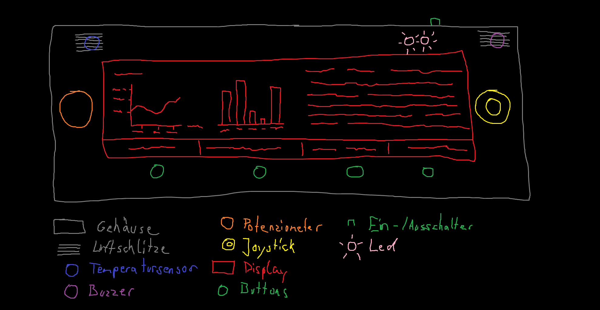
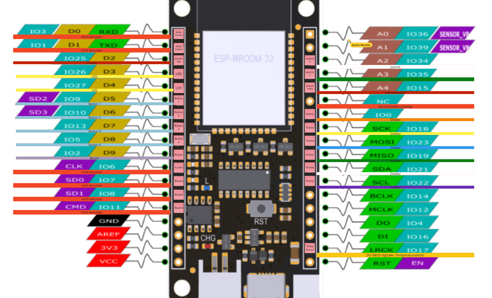
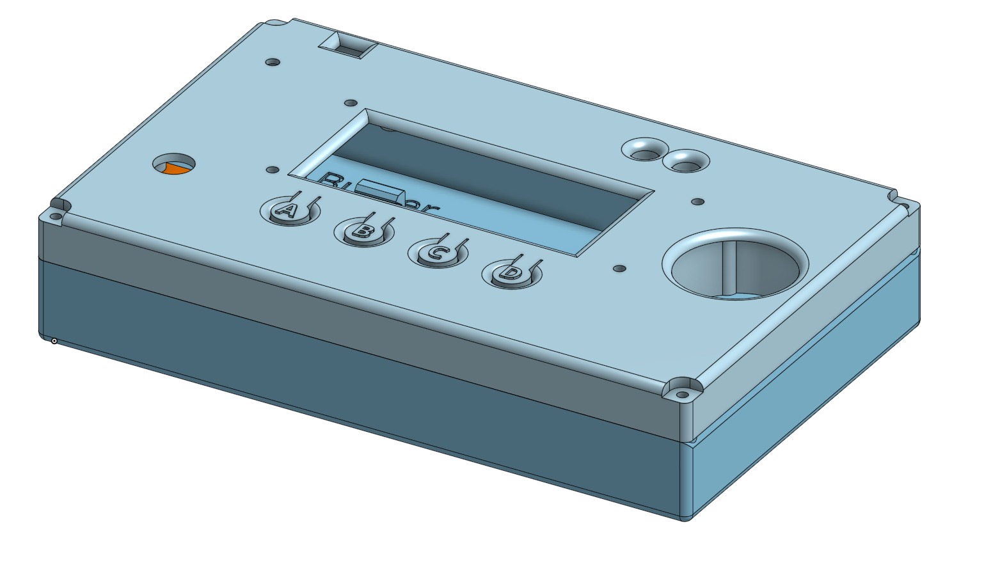

# BAG Programmierrunde - Monorepo

Hier findest du alle relevanten Dateien und Links rund um unser ESP32 Mikrocontroller-Projekt.
In dem Projekt entwickeln wir gemeinsam an einem Gerät, was durch die Integration zahlreicher Komponenten wie Display(s), Buttons, Joysticks, Buzzer, LEDs, Potentiometer, Schalter, Akkus, und eigentlich alle auf die wir so Lust haben, ein breites Spektrum an Funktionalitäten hat und mit dem wir herumexperimentieren und verschiedenste Programme dafür schreiben und Hardwareprobleme lösen :D.

## Anleitung
Dies ist unser Weg das Projekt aufzusetzen. Du kannst natürlich frei einen anderen wählen, so ist aber unser Workflow:
1. In Visual Studio Code die Extensions "C/C++" und "ESP-IDF" von "Microsoft" und "Espressif Systems" herunterladen
2. Im geöffnetem Willkommensfenster der ESP-IDF Extension ("ESP-IDF Setup") die "Express" Installation auswählen und anschließend die gegebenen Optionen wie gewünscht ausfüllen (am besten aber bei der Versionsauswahl die neuste auswählen (aktuell 5.5.1)) und auf "Install" klicken.
(Falls es sich bei dir nicht geöffnet hat, kannst du es aufrufen indem du auf den neu erschienenen ESP-IDF Reiter links in der Seitenleiste von VS Code klickst, und dann im Explorer links "Commands/Advanced" ausklappst und die erste Option "Configure ESP-IDF Extension" anklickst.)
3. Nach der Installation (die schon etwas dauern kann), kannst du dieses Github Repository hier klonen. Dazu musst du einfach in VS Code links auf den Reiter "Source Control" (oder alternativ oben zum File Explorer) gehen und nach dem Klicken auf "Clone Repository" den entsprechenden Link von Github einfügen und deinen gewünschten Zielordner fürs Klonen auswählen. (Achtung!: Hierfür ist vorausgesetzt dass du Git auf deinem Gerät installiert und mit VS Code verbunden hast. Wenn du es nicht alleine hinkriegst, kannst du uns sehr gerne fragen und wir helfen dir dann dabei das zusammen für dich einzurichten :).)
4. Nun, egal ob sich der Repo Ordner schon als Workspace in VS Code geöffnet hat oder nicht, gehe oben links in der Ecke auf "File", dann auf "Open Folder" und wähle, im geklonten Repository, den Ordner "trex_game" aus.
5. So. Jetzt sollte endlich alles klar sein und du kannst unten in der Leiste von Visual Studio auf das Schraubenschlüssel-Icon zum "Builden" des Projektes mit der ESP-IDF klicken und abwarten.
6. Jetzt solltest du startklar sein im Projekt rumzuprobieren! Mit angeschlossenem Mikrocontroller kannst du unten auf das Flammen-Icon klicken und deinen Code testen. Bei Fragen oder Problemen aller Art wende dich super gerne an uns. Dann können wir dir helfen dass es bei dir genauso einwandfrei läuft wie es das auch sollte. Viel Spaß! :D

# OUTDATED:

## Inhalt
- [Code](#code)
- [Schaltplan](#schaltplan)
- [Teileliste](#teileliste)
- [Gehäuse (CAD)](#gehäuse)
- [Quellcode](./DevDocs/schild/README.md)

## [Code](./DevDocs/schild/README.md)
Unter Schild befindet sich der Code.

## [Schaltplan](./DevDocs/schaltplan/README.md)
Unter Schaltplan befindet sich der Schaltplan.

## Teileliste
TODO Spalte 2 benennen
TODO Fehlende Infos ergänzen - für Infos die noch nicht bekannt sind "tbd" (to be defined) eintragen
TODO "..." entfernen

|Typ||Link1|
|---|---|---|
|Mikrocontroller|Firebeetle V3|[Beispiel](https://www.conrad.de/de/p/dfrobot-firebeetle-esp32-iot-microcontroller-supports-wi-fi-bluetooth-904154540.html)|
|Display|ePaper Display Modul mit SPI Interface|[Beispiel](https://www.conrad.de/de/p/2-9-296-128-epaper-display-modul-mit-spi-interface-906038105.html)|
|Akku|4000mAh Lithium-Polymer|[Beispiel](https://www.conrad.de/de/p/vhbw-akku-fuer-diverse-geraete-4000mah-3-7v-li-polymer-1x-zellen-883848869.html)|
|Temperatursensor|Dallas DS18B20|[Beispiel](https://www.amazon.de/AZDelivery-%E2%AD%90%E2%AD%90%E2%AD%90%E2%AD%90%E2%AD%90-DS18B20-digitaler-Temperatursensor/dp/B01LXQF9B5/ref=sr_1_5?dib=eyJ2IjoiMSJ9.LxzcCk8qNDxRTpENiHVx0vcEb46YMz7lcS4m12ODeGgsGO38hr86dbG7tw30_XUoqpBLBDEWpSm6U59VzRuJCPGFkWLMmT_tFqaGMfz2fSNcyp0V0s46Vyt0_Sb7yeje7llsfTkqKbQv64o_GGKSIRK3M4QtbPea2QMCtiBLBdpssYa6tL5BMrcsY3l3jg_2ECJVwQorqOe7mVwOXdKHSTF_konqcAQV6fFenJjT2HX7t1x7nhVZ-Xa9wV87l9UAixbJzmTe5MpUhLaRBaBZSnVPh6YkVU1OO8NalCQQZIM.EMezjXVyVyBySaGN_c4_Hgw62bq29DzgYVE-8AHpBvw&dib_tag=se&keywords=dallas+ds18b20&qid=1728499261&sr=8-5)|
|Potentiometer|...||
|Buzzer|Passive Buzzer|[Beispiel](https://www.amazon.de/gp/product/B0179I6LIK/ref=ppx_yo_dt_b_search_asin_title?ie=UTF8&psc=1)|
|Taster|...||
|Leuchtdioden (LED)|...||
|Schalter|...||
|Kabel|...||
|Joystick|Joystick Modul|[Beispiel](https://www.conrad.de/de/p/joy-it-joystick-modul-881921103.html)|

## FireBeetle ESP WROOM 32 - Pinout

### Mit Komponenten

## Gehäuse
Das Gehäuse kann in [OnShape](https://cad.onshape.com/documents/e09c03e3f038d8f4d3313e7c/w/14c21061c9193615a201d46b/e/6a487c004af487d85a03bcde) bearbeitet werden.

