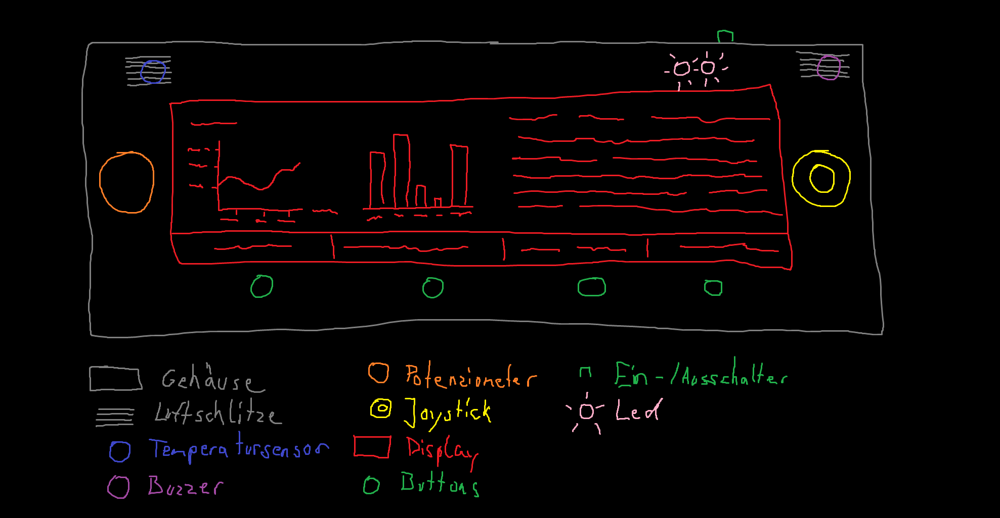

# BAG Programmierrunde - Monorepo

Hier findest du alle relevanten Dateien und Links rund um unser ESP32 Mikrocontroller-Projekt.
In dem Projekt entwickeln wir gemeinsam an einem Gerät, was durch die Integration zahlreicher Komponenten wie Display(s), Buttons, Joysticks, Buzzer, LEDs, Potentiometer, Schalter, Akkus, und eigentlich alle auf die wir so Lust haben, ein breites Spektrum an Funktionalitäten hat und mit dem wir herumexperimentieren und verschiedenste Programme dafür schreiben und Hardwareprobleme lösen :D.

## Anleitung
Dies ist unser Weg das Projekt aufzusetzen. Du kannst natürlich frei einen anderen wählen, so ist aber unser Workflow:
1. In Visual Studio Code die Extensions "C/C++" und "ESP-IDF" von "Microsoft" und "Espressif Systems" herunterladen
2. Im geöffnetem Willkommensfenster der ESP-IDF Extension ("ESP-IDF Setup") die "Express" Installation auswählen und anschließend die gegebenen Optionen wie gewünscht ausfüllen (am besten aber bei der Versionsauswahl die neuste auswählen (aktuell 5.5.1)) und auf "Install" klicken.
(Falls es sich bei dir nicht geöffnet hat, kannst du es aufrufen indem du auf den neu erschienenen ESP-IDF Reiter links in der Seitenleiste von VS Code klickst, und dann im Explorer links "Commands/Advanced" ausklappst und die erste Option "Configure ESP-IDF Extension" anklickst.)
3. Nach der Installation (die schon etwas dauern kann), kannst du dieses Github Repository hier klonen. Dazu musst du einfach in VS Code links auf den Reiter "Source Control" (oder alternativ oben zum File Explorer) gehen und nach dem Klicken auf "Clone Repository" den entsprechenden Link von Github einfügen und deinen gewünschten Zielordner fürs Klonen auswählen. (Achtung!: Hierfür ist vorausgesetzt dass du Git auf deinem Gerät installiert und mit VS Code verbunden hast. Wenn du es nicht alleine hinkriegst, kannst du uns sehr gerne fragen und wir helfen dir dann dabei das zusammen für dich einzurichten :).)
4. Nun, egal ob sich der Repo Ordner schon als Workspace in VS Code geöffnet hat oder nicht, gehe oben links in der Ecke auf "File", dann auf "Open Folder" und wähle, im geklonten Repository, den Ordner "DinoGame" aus.
5. Jetzt, falls du in deinem VS Code Explorer nach dem erfolgreichen Öffnen des Projektes einen .vscode Ordner findest, lösche ihn und gehe erneut in der Seitenleiste auf den ESP-IDF Reiter. Klappe nun etwas weiter unten den "Advanced" Reiter aus und klicke auf den Eintrag "Add .vscode subdirectory files".
7. Weiter sollte in der Leiste ganz unten in VS Code neben dem Feld "ESP-IDF v5.x.x" und dem Feld mit dem Stern "UART" stehen. Wenn bei dir hier etwas anderes steht (bspw. JTAG), klicke einmal auf den Text und wähle UART aus. Im Feld daneben sollte der richtige COM-Port stehen, wo dein ESP angeschlossen ist. Zur Not, klicke auch hier einmal auf das COM Feld und wähle den richtigen Port aus der sich öffnenden Liste in welcher mindestens ein Eintrag der ESP Name ist aus. Neben dem COM Port nun sollte als Gerät "esp32s3" ausgwählt sein. Hier auch wieder: Falls etwas anderes steht (z.B. nur "esp32"), klick drauf und wähl in der Liste das richtige. (Die Auswahl des Chips kannst du einfach ignorieren. Mit Escape oder einem Klick woanders auf den Bildschirm kannst du die Auswahl schließen.)
9. So. Jetzt sollte endlich alles klar sein und du kannst unten in der Leiste von Visual Studio auf das Schraubenschlüssel-Icon zum "Builden" des Projektes mit der ESP-IDF klicken und abwarten.
10. Jetzt solltest du startklar sein im Projekt rumzuprobieren! Mit angeschlossenem Mikrocontroller kannst du unten auf das Flammen-Icon klicken und deinen Code testen. Bei Fragen oder Problemen aller Art wende dich super gerne an uns. Dann können wir dir helfen dass es bei dir genauso einwandfrei läuft wie es das auch sollte. Viel Spaß! :D

(Zusätzlicher Tipp: Falls es aus unerklärlichen Gründen mal nicht builden und laufen sollte, lösche den "build" Ordner und versuche es ein paar mal erneut zu bauen. Hat uns öfter geholfen :).)
