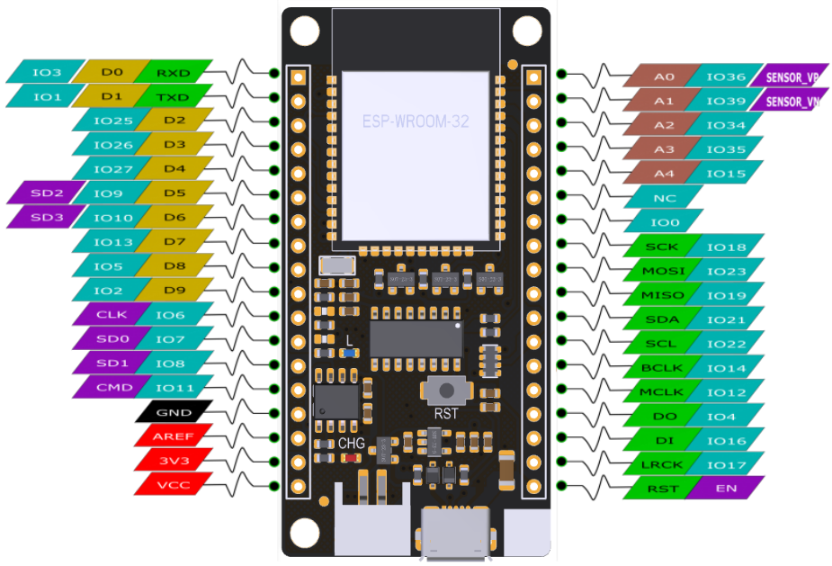

# BAG Programmierrunde - Monorepo

Hier finden Sie sämtliche relevanten Dateien und Links für unser ESP32-Projekt. Das Projekt widmet sich der Entwicklung eines Geräts, das durch die Integration zahlreicher Komponenten – darunter Buttons, ein Buzzer, ein E-Ink Display, LEDs, ein Joystick, ein Potentiometer, Schalter und ein Akku – ein breites Spektrum an Funktionalitäten ermöglicht.

## Inhalt
- [Code](#code)
- [Schaltplan](#schaltplan)
- [Teileliste](#teileliste)
- [Gehäuse (CAD)](#gehäuse)
- [Quellcode](./DevDocs/schild/README.md)

## [Code](./DevDocs/schild/README.md)

Unter Schild befindet sich der Code.

## [Schaltplan](./DevDocs/schaltplan/README.md)

Unter Schaltplan befindet sich der Schaltplan.

## Teileliste

TODO Spalte 2 benennen
TODO Fehlende Infos ergänzen - für Infos die noch nicht bekannt sind "tbd" (to be defined) eintragen
TODO "..." entfernen

|Typ||Link1|
|---|---|---|
|Mikrocontroller|Firebeetle V3|[Beispiel](https://www.conrad.de/de/p/dfrobot-firebeetle-esp32-iot-microcontroller-supports-wi-fi-bluetooth-904154540.html)|
|Display|ePaper Display Modul mit SPI Interface|[Beispiel](https://www.conrad.de/de/p/2-9-296-128-epaper-display-modul-mit-spi-interface-906038105.html)|
|Akku|4000mAh Lithium-Polymer|[Beispiel](https://www.conrad.de/de/p/vhbw-akku-fuer-diverse-geraete-4000mah-3-7v-li-polymer-1x-zellen-883848869.html)|
|Temperatursensor|Dallas DS18B20|[Beispiel](https://www.amazon.de/AZDelivery-%E2%AD%90%E2%AD%90%E2%AD%90%E2%AD%90%E2%AD%90-DS18B20-digitaler-Temperatursensor/dp/B01LXQF9B5/ref=sr_1_5?dib=eyJ2IjoiMSJ9.LxzcCk8qNDxRTpENiHVx0vcEb46YMz7lcS4m12ODeGgsGO38hr86dbG7tw30_XUoqpBLBDEWpSm6U59VzRuJCPGFkWLMmT_tFqaGMfz2fSNcyp0V0s46Vyt0_Sb7yeje7llsfTkqKbQv64o_GGKSIRK3M4QtbPea2QMCtiBLBdpssYa6tL5BMrcsY3l3jg_2ECJVwQorqOe7mVwOXdKHSTF_konqcAQV6fFenJjT2HX7t1x7nhVZ-Xa9wV87l9UAixbJzmTe5MpUhLaRBaBZSnVPh6YkVU1OO8NalCQQZIM.EMezjXVyVyBySaGN_c4_Hgw62bq29DzgYVE-8AHpBvw&dib_tag=se&keywords=dallas+ds18b20&qid=1728499261&sr=8-5)|
|Potentiometer|...||
|Buzzer|Passive Buzzer|[Beispiel](https://www.amazon.de/gp/product/B0179I6LIK/ref=ppx_yo_dt_b_search_asin_title?ie=UTF8&psc=1)|
|Taster|...||
|Leuchtdioden (LED)|...||
|Schalter|...||
|Kabel|...||
|Joystick|Joystick Modul|[Beispiel](https://www.conrad.de/de/p/joy-it-joystick-modul-881921103.html)|

## FireBeetle ESP WROOM 32 - Pinout

### Mit Komponenten

## Gehäuse

Das Gehäuse kann in [OnShape](https://cad.onshape.com/documents/e09c03e3f038d8f4d3313e7c/w/14c21061c9193615a201d46b/e/6a487c004af487d85a03bcde) bearbeitet werden.

