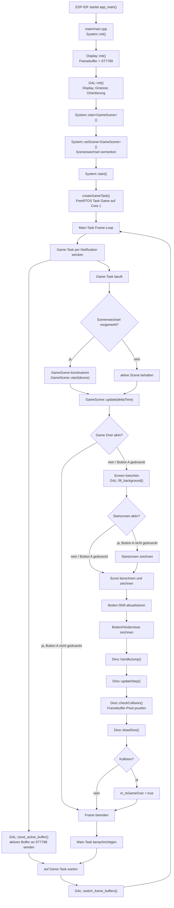

# Projektuebersicht

Diese Datei beschreibt, welche Rolle die Dateien im Projekt haben und welche Funktionen/Klassen besonders wichtig sind. Der aktuelle Build-Pfad ist das ESP-IDF-Projekt mit `main/` und `components/engine/`. Der Ordner `src/` ist eine alternative/alte Engine-Variante, die nur verwendet wird, wenn im Root-`CMakeLists.txt` `DINO_GAME_ELSE_NEW_ENGINE` auf `false` gesetzt wird. `docs/old-device/` ist Archivmaterial fuer den frueheren Hardware-/Softwarestand.

## Programmfluss

1. `main/main.cpp` ist der Einstiegspunkt und ruft `System::init()` sowie `System::start<GameScene>()` auf.
2. `System::init()` initialisiert Display und Graphics Abstraction Layer (`GAL`).
3. `System::start()` startet einen separaten FreeRTOS-Game-Task, sendet pro Frame den aktiven Framebuffer ans Display und wechselt danach die Framebuffer.
4. Der Game-Task ruft `Scene::update(deltaTime)` auf. Beim Dino-Spiel ist das `GameScene::update()`.
5. `GameScene` zeichnet Startscreen, Score, Boden/Hindernisse und Dino. Der Dino prueft Kollisionen gegen Pixel im Framebuffer.
6. `GAL` schreibt in den naechsten Framebuffer; `Display` verwaltet Double Buffering; `ST7789` uebertraegt die Pixeldaten per SPI.

## Root-Dateien

| Datei | Aufgabe |
| --- | --- |
| `README.md` | Projektbeschreibung, Setup-Anleitung fuer VS Code/ESP-IDF, Hardwareliste, Build-/Flash-/Monitor-Hinweise und TODO-Liste. |
| `CMakeLists.txt` | Root-Konfiguration fuer ESP-IDF. Schaltet ueber `DINO_GAME_ELSE_NEW_ENGINE` zwischen aktuellem Dino-Spiel (`main/`) und alter/alternativer Engine (`componentLinking` + `src/`) um. Wichtig: `project(PROJECT_NAME)` uebergibt aktuell den Literalnamen `PROJECT_NAME`, nicht den Variablenwert `${PROJECT_NAME}`. |
| `idf.bat` | Windows-Hilfsskript fuer ESP-IDF in der Konsole. |
| `CLAUDE.md` | Projekt-/Agentenhinweise fuer Claude; nicht Teil des Firmware-Builds. |

## Aktuelle App: `main/`

| Datei | Aufgabe |
| --- | --- |
| `main/CMakeLists.txt` | Registriert die App-Komponente fuer ESP-IDF. Kompiliert `game/dino.cpp`, `game/game_scene.cpp`, `main.cpp` und bindet `esp_timer`, `esp_driver_gpio` sowie die Komponente `engine` ein. |
| `main/Kconfig.projbuild` | Projektkonfiguration fuer ESP-IDF/Kconfig. Wird fuer buildbare Optionen genutzt. |
| `main/main.cpp` | Minimaler Firmware-Einstieg. `app_main()` initialisiert das System und startet `GameScene`. |

### Dino-Spiel

| Datei | Aufgabe |
| --- | --- |
| `main/game/game_scene.h` | Definiert `GameScene`, die von `Scene` erbt. Haelt Device-Zeiger, Startzeit, Bodenverschiebung, Dino-Instanz, Start-/Game-Over-Zustand und die aktuell sichtbaren Boden-Texturen. |
| `main/game/game_scene.cpp` | Implementiert den Spielablauf: Startscreen, Score, scrollenden Boden, Hindernis-Auswahl, Dino-Update und Game-Over-Erkennung. |
| `main/game/dino.h` | Definiert `Dino` mit Sprungparametern (`s_Force`, `s_Gravity`), Position, Sprunghoehe, Geschwindigkeit und Animationsschritt. |
| `main/game/dino.cpp` | Implementiert Sprungphysik, Laufanimation, Zeichnen des Dinos und Pixel-basierte Kollisionspruefung gegen Hindernisse im Framebuffer. |

Wichtige Funktionen in `GameScene`:

| Funktion | Bedeutung |
| --- | --- |
| `start(Device& device)` | Speichert das Device, setzt die Startzeit und initialisiert die Boden-Segmente. |
| `update(float deltaTime)` | Hauptlogik pro Frame. Bricht bei Game-Over-Screen ab, loescht den Screen, zeichnet UI/Boden/Dino und setzt Game Over bei Kollision. |
| `handleGameOverScreen()` | Haelt das Spiel an, solange Game Over aktiv ist. Button A beendet den Game-Over-Zustand, setzt aber aktuell noch nicht den kompletten Spielzustand zurueck. |
| `handleStartScreen()` / `drawStartScreen()` | Zeigt den Startscreen bis Button A gedrueckt wird. |
| `drawScore(float survivalSecs)` | Zeichnet den Score rechts oben. Der Score ist `survivalSecs * scoreMultiplier`. |
| `updateShift(float survivalSeconds)` | Erhoeht die Scroll-Position des Bodens. Die Geschwindigkeit steigt leicht mit der Ueberlebenszeit. |
| `handleGround()` | Aktualisiert bei voller Segmentbreite die Bodenliste und zeichnet alle Bodensegmente. |
| `updateGround()` | Schiebt Boden-Segmente nach links und waehlt ein neues Segment. Die Kaktus-Chance haengt davon ab, wie viele Kakteen bereits sichtbar sind. |
| `randomCactus()`, `randomGround()`, `randomCactusOrGround()` | Waehlen zufaellige Asset-Segmente aus `assets/ground.h`. |
| `drawText()` | Zeichnet Text aus dem Bitmap-Font. Zeichen werden ueber ASCII-Offset `text[i] - 33` im Font-Array gesucht. |
| `drawInt()` | Zeichnet Integer-Werte rechtsbuendig, z.B. den Score. |
| `getSurvivalSeconds()` | Berechnet die Zeit seit Szenenstart ueber `esp_timer_get_time()`. |

Wichtige Funktionen in `Dino`:

| Funktion | Bedeutung |
| --- | --- |
| `handleJump(float deltaTime, bool buttonPressed)` | Startet den Sprung bei Buttondruck, wendet Gravitation an und berechnet `m_CurrentY`. |
| `isGrounded()` | Liefert `true`, wenn `m_JumpHeight <= 0`. |
| `updateStep()` | Zaehlt den Animationsschritt von 0 bis 11 und wieder zurueck auf 0. |
| `drawDino()` | Zeichnet je nach Schritt `dino_rightstep` oder `dino_leftstep` an fester X-Position. |
| `checkCollision(Device& device)` | Prueft definierte Koordinaten an Dino-Koerper und Fuessen gegen `FOREGROUND_COLOR` im Framebuffer. Treffer werden rot markiert. Enthaltet aktuell Debug-Code, u.a. eine rote Linie. |

### Game-Assets

| Datei | Aufgabe |
| --- | --- |
| `main/game/assets/color.h` | Legt die Spiel-Farbkonstanten fest: `BACKGROUND_COLOR` ist `WHITE`, `FOREGROUND_COLOR` ist `BLACK`. |
| `main/game/assets/dino.h` | Enthaelt 1-Bit-Bitmapdaten fuer den Dino (`dino_default`, `dino_leftstep`, `dino_rightstep`) sowie `DINO_WIDTH = 34` und `DINO_HEIGHT = 36`. |
| `main/game/assets/ground.h` | Enthaelt 1-Bit-Bitmapdaten fuer Boden- und Kaktus-Segmente. `ground_t` verknuepft Texture-Pointer und `isCactus`; `grounds` ist die Auswahlbasis fuer zufaellige Segmente. |
| `main/game/assets/font.h` | Enthaelt einen 3x6-Pixel-Bitmap-Font als kompaktes Bitarray. Wird von `GameScene::drawText()` und `drawInt()` genutzt. |

## Engine-Komponente: `components/engine/`

| Datei | Aufgabe |
| --- | --- |
| `components/engine/CMakeLists.txt` | Registriert die Engine-Komponente fuer ESP-IDF. Kompiliert Display, GAL, Input, Core und Debug-Helfer. |
| `components/engine/engine.h` | Sammel-Header fuer Engine-Nutzer. Inkludiert Core, Display, GAL und Input. |

### Core

| Datei | Aufgabe |
| --- | --- |
| `components/engine/core/system.h` | Deklariert die zentrale statische `System`-Klasse. Haelt `Device`, Task-Handles, aktive `Scene` und verzoegerten Szenenwechsel. |
| `components/engine/core/system.cpp` | Initialisiert Display/GAL, verwaltet Main-Loop und Game-Task, misst FPS/Frametimes und synchronisiert Rendern/Update per FreeRTOS-Notifications. |
| `components/engine/core/device.h` | Definiert `Device` als Buendel aus `Display` und zwei Buttons. |
| `components/engine/core/device.cpp` | Initialisiert Button A auf GPIO 13 und Button B auf GPIO 14; bietet Zugriff auf Display und Buttonzustand. |
| `components/engine/core/scene.h` | Basisklasse fuer Szenen. `start(Device&)` ist optional, `update(float)` ist rein virtuell. |
| `components/engine/core/scene.cpp` | Leere Implementierungsdatei fuer den Scene-Typ. |
| `components/engine/core/poly_value.h` | Kleiner polymorpher Value-/Smart-Pointer-Ersatz. Speichert Objekte ueber Basisklassenzeiger, kann kopieren/verschieben und wird fuer aktive Szenen genutzt. |
| `components/engine/core/any_callable.h` | Kleine `std::function`-Alternative auf Basis von `PolyValue`. Wird fuer `delayedSceneSwitchFunc` genutzt. |
| `components/engine/core/macros.h` | Template-/Meta-Helfer: Typpruefungen, Member-Erkennung, statische Schleifen und Funktionszeiger-Introspektion. |

Wichtige Funktionen in `System`:

| Funktion | Bedeutung |
| --- | --- |
| `init()` | Initialisiert Display, richtet `GAL` fuer Landscape ein und leert beide Framebuffer. |
| `start()` | Erstellt den Game-Task und startet die dauerhafte Render-Schleife: Game-Task wecken, aktiven Buffer senden, auf Game-Task warten, Buffer wechseln. |
| `start<SceneT>()` | Setzt eine Szene und startet danach das System. Wird im Projekt mit `GameScene` genutzt. |
| `setScene<SceneT>()` | Speichert eine Lambda-Funktion, die beim naechsten Game-Task-Durchlauf die alte Szene zerstoert, die neue Szene konstruiert und `start(device)` aufruft. |
| `createGameTask()` | Erstellt den FreeRTOS-Task `Game` auf Core 1. |
| `gameTask(void*)` | Wartet auf Frame-Notification, schaltet ggf. Szene, ruft `scene->update(deltaTime)` auf und meldet Fertigstellung an den Main-Task. |

### Display und Treiber

| Datei | Aufgabe |
| --- | --- |
| `components/engine/display/display.h` | Deklariert `Display`, Double Buffering und Zugriff auf den ST7789-Treiber. |
| `components/engine/display/display.cpp` | Allokiert zwei DMA-/SPIRAM-Framebuffer, initialisiert den Treiber und bietet Pixel-/Frame-/Buffer-Operationen. |
| `components/engine/display/st7789.h` | Deklariert ST7789-Kommandos, Orientierungstypen und die Klasse `ST7789`. |
| `components/engine/display/st7789.cpp` | Initialisiert SPI und ST7789, setzt Color Mode/Orientation/Address Window und sendet Pixeldaten in gequeueten SPI-Transaktionen. |
| `components/engine/display/driver.h` | Platzhalter-Basistyp `Driver`. Aktuell ohne Funktion. |
| `components/engine/display/driver.cpp` | Leere Implementierungsdatei fuer `Driver`. |
| `components/engine/display/color.h` | Waehlt den aktiven Farbtyp. Aktuell `using Color = Color16`. |
| `components/engine/display/color16.h` | Definiert 16-Bit-RGB565-Farben mit Byte-Swap fuer das Display (`BLACK`, `WHITE`, `RED`, `GREEN`, `BLUE`) und `ColorSize = 2`. |
| `components/engine/display/color24.h` | Alternative 24-Bit-Farbstruktur mit RGB-Komponenten und `ColorSize = 3`. Aktuell nicht aktiv eingebunden. |

Wichtige Funktionen in `Display`:

| Funktion | Bedeutung |
| --- | --- |
| `init()` | Ruft `initBuffers()` und `initDriver()` auf. |
| `initBuffers()` | Allokiert zwei Framebuffer im DMA-/SPIRAM-faehigen Speicher. |
| `getPixel(int)` / `setPixel(int, Color)` | Lesen/schreiben Pixel im naechsten Framebuffer. Die Kollisionslogik nutzt `getPixel()`. |
| `setFrame(Color)` | Fuellt den kompletten naechsten Framebuffer. |
| `setOrientation(...)` | Delegiert Orientierung an `ST7789::setOrientation()`. |
| `switchFrameBuffers()` | Tauscht aktiven und naechsten Framebuffer. |
| `sendActiveBuffer()` | Sendet den aktiven Framebuffer ueber den ST7789-Treiber. |

Wichtige Funktionen in `ST7789`:

| Funktion | Bedeutung |
| --- | --- |
| `init()` | Initialisiert SPI, Reset-Pin, Display-Kommandos, Color Mode, Sleep-Out und Display-On. |
| `initSPI()` | Konfiguriert SPI2 mit MOSI 11, CLK 12, CS 10, DC 17 und 80 MHz. |
| `setColorMode()` | Setzt 16-Bit- oder 24-Bit-Farbmodus abhaengig von `ColorSize`. |
| `setOrientation(...)` | Schreibt `MADCTL` und setzt das Address Window auf die gewuenschte Breite/Hoehe. |
| `setAddressWindow(...)` | Setzt Column/Row Range und startet `RAMWR`. |
| `sendDataQueued(const Color*)` | Sendet den gesamten Bildschirm in Chunks ueber mehrere SPI-Transaktionen. |
| `sendCmd(uint8_t)` / `sendData(...)` | Low-Level SPI-Transfers fuer Kommandos und Daten. |

### Graphics Abstraction Layer

| Datei | Aufgabe |
| --- | --- |
| `components/engine/gal/gal.h` | Deklariert die statische Zeichen-API `GAL`. |
| `components/engine/gal/gal.cpp` | Implementiert Fuellen, Sprite-Zeichnen, orientiertes Zeichnen, Linien und Buffer-Delegation. |

Wichtige Funktionen in `GAL`:

| Funktion | Bedeutung |
| --- | --- |
| `init(Display*, width, height, orientation)` | Speichert Display-Ziel, logische Groesse und Ausrichtung. |
| `set_orientation(orientation_t)` | Aendert die logische Orientierung und tauscht bei Portrait/Landscape-Wechsel Breite/Hoehe. |
| `fill_background(Color)` | Fuellt den naechsten Framebuffer ueber `Display::setFrame()`. |
| `draw(...)` | Zeichnet ein 1-Bit-Sprite mit vertikalem Scroll-Offset nahe dem unteren Bildschirmrand. |
| `draw_at(...)` | Zeichnet ein 1-Bit-Sprite an Koordinaten, mit Skalierung, Clipping und optional nur Vordergrundpixeln. Unterstuetzt Orientierungstransformation. |
| `switch_frame_buffers()` / `send_active_buffer()` | Delegiert Bufferwechsel und Uebertragung an `Display`. |
| `draw_vertical_line()` / `draw_horizontal_line()` | Zeichnet einfache Linien in den Framebuffer. |
| `draw_placeholder()` / `draw_pixels()` | Debug-/Test-Zeichenfunktionen. |

### Input

| Datei | Aufgabe |
| --- | --- |
| `components/engine/input/button.h` | Deklariert `Button` mit GPIO-Pin und Feldern fuer Debounce. |
| `components/engine/input/button.cpp` | Konfiguriert GPIO als Input mit Pullup. `isPressed()` liest aktuell direkt den Pin; der Debounce-Code ist vorhanden, aber auskommentiert. |

Wichtige Funktion:

| Funktion | Bedeutung |
| --- | --- |
| `Button::isPressed()` | Gibt `true` zurueck, wenn der Pin LOW ist. Buttons sind also active-low verdrahtet. |

### Debug

| Datei | Aufgabe |
| --- | --- |
| `components/engine/debug/debug_measurement.h` | Deklariert `DebugMeasurement` zum Messen und Sammeln eindeutiger Laufzeiten. |
| `components/engine/debug/debug_measurement.cpp` | Implementiert `start()`, `stop()` und `print()` ueber `esp_timer_get_time()` und ESP-Logging. |

## Alternative/alte Engine: `src/` und `componentLinking/`

Diese Dateien sind nicht Teil des aktuellen Dino-Spiel-Builds, solange `DINO_GAME_ELSE_NEW_ENGINE` in `CMakeLists.txt` auf `true` steht.

| Datei | Aufgabe |
| --- | --- |
| `componentLinking/CMakeLists.txt` | Registriert fuer die alternative Build-Variante `src/main/main.cpp` als ESP-IDF-Komponente und bindet GPIO, SPI und Timer ein. |
| `src/main/main.cpp` | Alter/alternativer Einstiegspunkt. Initialisiert Button an GPIO 7, Display, zeichnet Linien bei Button-Events und laesst FreeRTOS regelmaessig yielden/delayen. |
| `src/main/Display.hpp` | Header-only ST7789-/SPI-Displayklasse mit Double Buffering, `fill()`, `setPixel()`, Linienfunktionen und Chunked SPI-Transfer. |
| `src/engine/Color.hpp` | Kleine RGB/RGBA-Farbstruktur mit Umwandlung zu/von RGB565. |
| `src/engine/IntervalTimer.hpp` | Generischer Intervall-Timer. `tryUpdate(curTime)` liefert `true`, wenn das konfigurierte Intervall abgelaufen ist. |

## Tools

| Datei | Aufgabe |
| --- | --- |
| `docs/tools/tools.md` | Kurze Tool-Dokumentation: Font-Generation und ESP-IDF-Konsole unter Windows/Mac. |
| `docs/tools/idf.sh` | Mac-/Shell-Hilfsskript zum Starten der ESP-IDF-Umgebung. |

### Font-Generation: `docs/tools/font_generation/`

| Datei | Aufgabe |
| --- | --- |
| `docs/tools/font_generation/README.md` | Kurzanleitung fuer das Font-Generation-Tool. |
| `docs/tools/font_generation/pyproject.toml` | Python-Projektmetadaten und Abhaengigkeiten: `numpy`, `pillow`, `rich-pixels`, `textual`, `textual-dev`. |
| `docs/tools/font_generation/font_template_generator.py` | Erzeugt eine leere Bitmap-Vorlage fuer 5x7-Fonts mit Rasterlinien und speichert `font_template_5x7.bmp`. |
| `docs/tools/font_generation/font_generator.py` | Liest eine Bitmap-Fontdatei und wandelt die Pixel in ein C-Header-Array um. Status laut Kommentar: in Arbeit. |
| `docs/tools/font_generation/src/main.py` | Startpunkt der Textual-App. Oeffnet `MenuScreen`. |
| `docs/tools/font_generation/src/components/file_list.py` | `FileList`-Widget zum Anzeigen von Dateien/Ordnern eines Pfads. |
| `docs/tools/font_generation/src/components/font_preview.py` | `FontPreview`-Widget, das eine Bitmap per Pillow laedt und mit `rich_pixels` im Terminal rendert. |
| `docs/tools/font_generation/src/screens/menu.py` | Hauptmenue der Textual-App mit Navigation zu Font, Fonts und Templates. |
| `docs/tools/font_generation/src/screens/font.py` | Screen mit Texteingabe und Font-Vorschau. Referenziert aktuell `data/fonts/font_5x7.bmp`, die im Repo nach Dateiliste nicht vorhanden ist. |
| `docs/tools/font_generation/src/screens/fonts.py` | Screen fuer die Liste vorhandener Font-Bitmaps in `data/fonts`. |
| `docs/tools/font_generation/src/screens/templates.py` | Screen fuer die Liste vorhandener Templates in `data/templates`. |
| `docs/tools/font_generation/data/fonts/*.bmp` | Beispiel-/Arbeits-Fontbitmaps. |
| `docs/tools/font_generation/data/templates/*.bmp` | Bitmap-Vorlagen fuer Font-Erstellung. |
| `docs/tools/font_generation/*.bmp` | Arbeits-/Test-Bitmaps wie `out.bmp`, `play.bmp`, `retry.bmp`. |

## Hardware- und Mediendokumentation

| Datei/Ordner | Aufgabe |
| --- | --- |
| `docs/media/esp32-s3_devkitc-1_pinlayout_v1.1.jpg` | Pinout-Bild fuer das ESP32-S3-DevKitC-1. Wird im README angezeigt. |
| `docs/media/EspEngineProject.mp4` | Video/Medienmaterial zum Projekt. |
| `docs/hardware/case/Console.3mf` | 3D-Modell fuer das Konsolengehaeuse. |
| `docs/hardware/case/CaseUSBBreakout.3mf` | 3D-Modell fuer USB-Breakout/Case-Teil. |
| `docs/hardware/kicad/console.kicad_pro` | KiCad-Projektdatei fuer die aktuelle Konsole. |
| `docs/hardware/kicad/console.kicad_sch` | KiCad-Schaltplan. |
| `docs/hardware/kicad/console.kicad_pcb` | KiCad-Boardlayout. |
| `docs/hardware/kicad/console_library.kicad_sym` | Projektspezifische KiCad-Symbolbibliothek. |
| `docs/hardware/kicad/fp-lib-table` / `sym-lib-table` | KiCad Footprint-/Symbol-Library-Tabellen. |
| `docs/hardware/kicad/console_footprints.pretty/*.kicad_mod` | Projektspezifische Footprints fuer ESP32-S3 und TFT-Display. |
| `docs/hardware/kicad/fp-info-cache`, `console.kicad_prl` | KiCad-Cache-/Projektlokaldateien. Nicht zentral fuer Firmwarelogik. |

## Archiv: `docs/old-device/`

`docs/old-device/` enthaelt Material des frueheren Geraetestands. Es ist fuer Recherche und Historie nuetzlich, gehoert aber nicht zum aktuellen ESP-IDF-Dino-Build.

| Datei/Ordner | Aufgabe |
| --- | --- |
| `docs/old-device/media/` | Bilder alter Hardware-/Pinout-/CAD-Planung. |
| `docs/old-device/case/` | Alte FreeCAD-Gehaeusedateien und heruntergeladene Ressourcen fuer mechanische Teile. |
| `docs/old-device/schaltplan/` | Alter KiCad-Schaltplan inklusive Backups und importierter DFR0478/FIREBEETLE-Bibliotheken fuer verschiedene CAD-Tools. |
| `docs/old-device/sources/platformio.ini` | PlatformIO-Konfiguration des alten Softwarestands. |
| `docs/old-device/sources/src/` | Alter C++-Code mit Komponenten wie Button, Display, Joystick, LED, Potentiometer, Buzzer, Szenen und Core-Struktur. |
| `docs/old-device/sources/lib/esp32-waveshare-epd/` | Eingebettete externe Waveshare-E-Paper-Library mit vielen Displaytreibern und Beispielen. |
| `docs/old-device/sources/main/` | Alter ESP-IDF-/Komponenten-Linking-Versuch innerhalb des Archivs. |

## Bekannte Baustellen und Auffaelligkeiten

| Bereich | Hinweis |
| --- | --- |
| Game Over | `handleGameOverScreen()` setzt nur `m_IsGameOver` zurueck. Dino, Boden, Score/Zeit und Hindernisse werden noch nicht sauber resetet. |
| Kollision | `Dino::checkCollision()` ist stark an Displaygroesse, Rotation und konkrete Pixelkoordinaten gekoppelt. Debug-Zeichnung ist noch aktiv. |
| Button Debounce | In `Button::isPressed()` ist Debounce auskommentiert. Der Button wird direkt gelesen. |
| CMake-Projektname | Root-`CMakeLists.txt` nutzt `project(PROJECT_NAME)` statt `project(${PROJECT_NAME})`. |
| Font-Tool | `FontScreen` referenziert `data/fonts/font_5x7.bmp`; in der Dateiliste existieren stattdessen z.B. `font_3x6.bmp` und `front_3x5.bmp`. |
| Farbformat | Aktuell ist `Color16` aktiv. `Color24` existiert als Alternative, wuerde aber wegen `ColorSize` und Speicher-/SPI-Transfergroessen bewusst getestet werden muessen. |
| Orientierung | `GAL::draw_at()` enthaelt eigene Orientierungstransformation, waehrend `Display::setOrientation()` den ST7789 konfigurieren kann. Das Zusammenspiel ist ein wichtiger Punkt bei Rendering-Fehlern. |
| Archivdateien | Viele Dateien unter `docs/old-device/` sind Backups, CAD-Imports oder externe Librarydateien. Aenderungen dort beeinflussen den aktuellen Build normalerweise nicht. |
